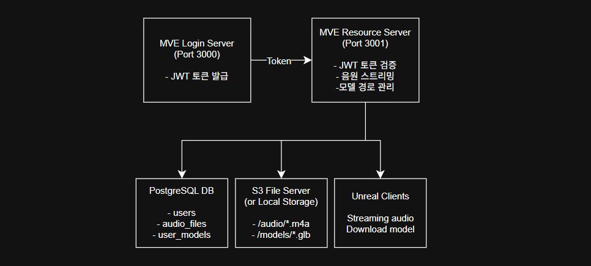

# MVE 프로젝트

원티드 포텐업 [언리얼 & AI] 최종 프로젝트의 서버 모노레포입니다.<br>
인증 및 리소스 서버는 AWS EC2 인스턴스에 배포하고 파일 서버로 AWS S3 버킷을 사용하는 것을 상정합니다.<br>
각종 인증 및 리소스 API 요청을 전송하고 리스폰스를 받는 주체는 언리얼 클라이언트 프로세스로 상정합니다.<br>

각 서브모듈에 대한 자세한 내용은 깃허브 리포지토리 페이지를 방문하여 확인하세요.

- **https://github.com/prayslaks/mve-login-server**
- **https://github.com/prayslaks/mve-resource-server**

**⚠️ 주의**: Claude Code 바이브 코딩으로 개발했으므로, 함부로 실제 서비스에 사용하다 보안 문제가 발생해도 책임지지 않습니다.

---

## 서브모듈 구성

- **[mve-login-server](mve-login-server/)** - 인증 전용 서버 (회원가입, 로그인, 로그아웃, 회원탈퇴, JWT 토큰 발급)
- **[mve-resource-server](mve-resource-server/)** - 리소스 파일 관리 서버 (음원 스트리밍, 3D 모델 경로 관리)

---

## 아키텍처



---

## 최초 1회 AWS EC2 배포 환경 설정

```bash
# 시스템 업데이트
sudo apt update && sudo apt upgrade -y

# Node.js 20.x 설치
curl -fsSL https://deb.nodesource.com/setup_20.x | sudo -E bash -
sudo apt install -y nodejs

# PostgreSQL 설치
sudo apt install -y postgresql postgresql-contrib

# Redis 설치
sudo apt install -y redis-server

# Git 설치
sudo apt install -y git

# 버전 확인
node --version
npm --version
psql --version
redis-server --version

# PostgreSQL 서비스 시작
sudo systemctl start postgresql
sudo systemctl enable postgresql

# Redis 서비스 시작
sudo systemctl start redis-server
sudo systemctl enable redis-server
```

```bash
# 서브모듈까지 클론
git clone --recursive https://github.com/prayslaks/mve-servers.git

# 통합 리포지토리로 이동
cd mve-servers

# 서브모듈까지 초기화
git submodule update --init --recursive
```

### 환경 변수 설정

두 서버는 다음 환경 설정을 **반드시 동일하게** 유지해야 합니다:

- JWT 토큰 값이 일치하지 않으면 특정 API 이용 불가
- 데이터베이스 값이 일치하지 않으면 정상 처리 불가
- Redis 값이 일치하지 않으면 각 서버가 독립적인 Redis를 사용하게 됨

SMTP 설정이나 파일 서버 설정 등은 각자 역할에 따라서 구분됩니다.

#### 로그인 서버 예시
```env
# 로그인 서버 포트 번호
PORT=3000

# 데이터베이스 환경설정
DB_HOST=localhost
DB_PORT=5432
DB_USER=your_db_user
DB_PASSWORD=your_db_password
DB_NAME=mve_login_db

# 최소 32자 이상의 랜덤 JWT 비밀 키 (리소스 서버의 JWT 키와 동일해야 함)
JWT_SECRET=your_secret_key_here_make_it_long_and_random

# 인증 번호 전송 이메일 SMTP 환경설정
EMAIL_HOST=smtp.naver.com
EMAIL_PORT=587
EMAIL_SECURE=false
EMAIL_USER=your_naver_email@naver.com
EMAIL_PASSWORD=your_naver_app_password

# Redis 환경설정 (이메일 인증번호 및 Rate Limiting)
REDIS_HOST=localhost
REDIS_PORT=6379
REDIS_PASSWORD=
```

#### 리소스 서버 예시 (S3)

```env
# 서버 포트
PORT=3001

# 데이터베이스 환경 설정 (로그인 서버와 동일해야 함)
DB_HOST=localhost
DB_PORT=5432
DB_USER=your_db_user
DB_PASSWORD=your_db_password
DB_NAME=mve_login_db

# S3 버킷 환경 설정 (IAM Role에 의해 EC2 인스턴스는 자동으로 권한 획득)
STORAGE_TYPE=s3
S3_BUCKET=your_bucket
AWS_REGION=your_region

# 최소 32자 이상의 랜덤 JWT 비밀 키 (로그인 서버의 JWT 키와 동일해야 함)
JWT_SECRET=your_secret_key_here_make_it_long_and_random

# AWS S3 버킷 경로 (음원 및 모델링 파일이 저장된 파일 서버)
FILE_SERVER_PATH=./files

# Redis 환경 설정 (콘서트 세션 관리용)
REDIS_HOST=localhost
REDIS_PORT=6379
REDIS_PASSWORD=
```

**⚠️ 주의**: 자세한 내용은 각 서브모듈 리포지토리의 README.md와 .env.example을 참고해 설정합니다.

```bash
# 최초 1회 이후에는 쉘로 하드 셋업 가능
chmod +x aws-ubuntu-hardsetup-servers.sh
./aws-ubuntu-hardsetup-servers.sh
```

```bash
# 통합 서버 기본 설정 (밑 코드 참고)
sudo nano /etc/nginx/sites-enabled/default

# 너무 긴 EC2 도메인을 위해 server_names_hash_bucket_size 수정
sudo nano /etc/nginx/nginx.conf

# 기본 설정만 남기고 이전 로그인 서버 설정 제거
sudo rm /etc/nginx/sites-enabled/mve-login-server

# 정상 제거 확인
ls -la /etc/nginx/sites-enabled/

# 설정 활성화
sudo nginx -t && sudo systemctl reload nginx
```

```bash
# 기본 설정 이후에 nginx 재구동
sudo nginx -t && sudo systemctl reload nginx

# 밑 내용을 sudo nano /etc/nginx/sites-enabled/default로 작성
server {
    listen 80;
    
    # 용량 제한 100MB
    client_max_body_size 100M;
    
    # EC2 도메인 또는 퍼블릭 IP
    server_name your-domain.com;

    # 헬스 체크 API
    location /health/login {
        proxy_pass http://localhost:3000;
        proxy_http_version 1.1;
        proxy_set_header Host $host;
        proxy_set_header X-Real-IP $remote_addr;
        proxy_set_header X-Forwarded-For $proxy_add_x_forwarded_for;
    }

    location /health/resource {
        proxy_pass http://localhost:3001;
        proxy_http_version 1.1;
        proxy_set_header Host $host;
        proxy_set_header X-Real-IP $remote_addr;
        proxy_set_header X-Forwarded-For $proxy_add_x_forwarded_for;
    }

    # Resource Server API
    location /api/audio {
        proxy_pass http://localhost:3001;
        proxy_http_version 1.1;
        proxy_set_header Host $host;
        proxy_set_header X-Real-IP $remote_addr;
        proxy_set_header X-Forwarded-For $proxy_add_x_forwarded_for;
    }

    location /api/models {
        proxy_pass http://localhost:3001;
        proxy_http_version 1.1;
        proxy_set_header Host $host;
        proxy_set_header X-Real-IP $remote_addr;
        proxy_set_header X-Forwarded-For $proxy_add_x_forwarded_for;
    }

    location /api/concert {
        proxy_pass http://localhost:3001;
        proxy_http_version 1.1;
        proxy_set_header Host $host;
        proxy_set_header X-Real-IP $remote_addr;
        proxy_set_header X-Forwarded-For $proxy_add_x_forwarded_for;
    }

    location /api/accessory-presets {
        proxy_pass http://localhost:3001;
        proxy_http_version 1.1;
        proxy_set_header Host $host;
        proxy_set_header X-Real-IP $remote_addr;
        proxy_set_header X-Forwarded-For $proxy_add_x_forwarded_for;
    }

    # Login Server API (기본)
    location / {
        proxy_pass http://localhost:3000;
        proxy_http_version 1.1;
        proxy_set_header Host $host;
        proxy_set_header X-Real-IP $remote_addr;
        proxy_set_header X-Forwarded-For $proxy_add_x_forwarded_for;
    }
}
```

```bash
# psql 콘솔 활성화
sudo -u postgres psql

# psql 콘솔 명령어 =========================
CREATE DATABASE logindb;
ALTER USER postgres WITH PASSWORD '새로운비밀번호';
# psql 콘솔 명령어 =========================

# peer 인증에서 비밀번호로 전환
sudo nano /etc/postgresql/*/main/pg_hba.conf

# psql 재구동
sudo systemctl restart postgresql

# PostgreSQL에서 데이터베이스 생성
psql -U postgres -c "CREATE DATABASE logindb;"

# Login Server 테이블 생성
psql -U postgres -d logindb -f mve-login-server/init.sql

# Resource Server 테이블 생성
psql -U postgres -d logindb -f mve-resource-server/init.sql
```

```bash
# 서버 배포 쉘 스크립트 실행
./aws-ubuntu-start-servers.sh
```

---

## 최초 1회 AWS EC2 배포 이후 업데이트

```bash
# 한번 하드 셋업된 이후부터는 소프트 셋업으로도 충분히 최신 버전 유지
./aws-ubuntu-setup-servers.sh

# 만약 예기치 못한 문제가 발생했다면 하드 셋업으로 완전히 초기화 (환경 설정 파일은 유지)
./aws-ubuntu-hardsetup-servers.sh

# 서버 재구동
pm2 restart all
```

---

## Windows 로컬 개발 환경 설정

Node.js, PostgreSQL, Git이 설치되어 있어야 합니다.

```powershell
# 서브모듈까지 클론
git clone --recursive https://github.com/prayslaks/mve-servers.git

# 통합 리포지토리로 이동
cd mve-servers

# 서브모듈까지 초기화
git submodule update --init --recursive
```

#### 로그인 서버 예시 (로컬과 AWS EC2 모두 동일)
```env
# 로그인 서버 포트 번호
PORT=3000

# 데이터베이스 환경설정
DB_HOST=localhost
DB_PORT=5432
DB_USER=your_db_user
DB_PASSWORD=your_db_password
DB_NAME=mve_login_db

# 최소 32자 이상의 랜덤 JWT 비밀 키 (리소스 서버의 JWT 키와 동일해야 함)
JWT_SECRET=your_secret_key_here_make_it_long_and_random

# 인증 번호 전송 이메일 SMTP 환경설정
EMAIL_HOST=smtp.naver.com
EMAIL_PORT=587
EMAIL_SECURE=false
EMAIL_USER=your_naver_email@naver.com
EMAIL_PASSWORD=your_naver_app_password

# Redis 환경설정 (이메일 인증번호 및 Rate Limiting)
REDIS_HOST=localhost
REDIS_PORT=6379
REDIS_PASSWORD=
```

#### 리소스 서버 예시 (로컬)

```env
# 서버 포트
PORT=3001

# 데이터베이스 환경 설정 (로그인 서버와 동일해야 함)
DB_HOST=localhost
DB_PORT=5432
DB_USER=your_db_user
DB_PASSWORD=your_db_password
DB_NAME=mve_login_db

# 스토리지 환경 설정 (값이 's3'가 아니라면 자동으로 로컬 스토리지로 간주)
STORAGE_TYPE=local

# 최소 32자 이상의 랜덤 JWT 비밀 키 (로그인 서버의 JWT 키와 동일해야 함)
JWT_SECRET=your_secret_key_here_make_it_long_and_random

# 로컬 스토리지 경로 (음원 및 모델링 파일이 저장된 파일 서버)
FILE_SERVER_PATH=./files

# Redis 환경 설정 (콘서트 세션 관리용)
REDIS_HOST=localhost
REDIS_PORT=6379
REDIS_PASSWORD=
```

```powershell
# psql 콘솔 명령어 =========================
CREATE DATABASE logindb;
ALTER USER postgres WITH PASSWORD '새로운비밀번호';
# psql 콘솔 명령어 =========================
```

```powershell
# PostgreSQL에서 데이터베이스 생성
psql -U postgres -c "CREATE DATABASE logindb;"

# Login Server 테이블 생성
psql -U postgres -d logindb -f mve-login-server/init.sql

# Resource Server 테이블 생성
psql -U postgres -d logindb -f mve-resource-server/init.sql
```

```powershell
# 의존성 설치 (git fetch/pull + 서브모듈 업데이트 + npm install)
windows-local-setup-servers.bat

# 서버 실행
windows-local-start-servers.bat
```

---

## AWS EC2 보안 그룹 설정

| 유형 | 포트 | 소스 | 설명 |
|------|------|------|------|
| HTTPS | 443 | 0.0.0.0/0 | 프로덕션 서비스 |
| HTTP | 80 | 0.0.0.0/0 | 프로덕션 서비스 |
| SSH | 22 | 내 IP | 서버 관리용 |
| Custom TCP | 3000 | 내 IP | 개발용 Login Server |
| Custom TCP | 3001 | 내 IP | 개발용 Resource Server |

---

## 기술 스택

- **Node.js** - 런타임 환경
- **Express** - 웹 프레임워크
- **PostgreSQL** - 관계형 데이터베이스
- **Redis** - 인메모리 데이터 저장소 (이메일 인증, 콘서트 세션 관리)
- **JWT** - 인증 토큰
- **PM2** - 프로세스 관리
- **Nginx** - 리버스 프록시
- **AWS S3** - 파일 스토리지 (프로덕션)

---

## 라이선스

이 프로젝트는 포트폴리오 목적으로 개발되었습니다.
